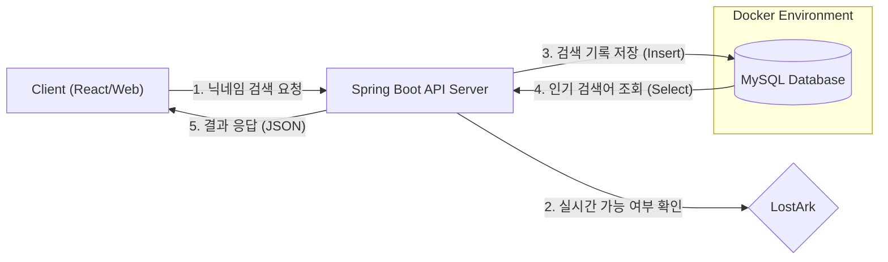

# 🔍 Loa Nickname Search (Backend API)

> **"로스트아크 닉네임, 게임 접속 없이 API로 빠르게 검색하세요."**
> Lost Ark Nickname Availability Check & Search API Service

<br>

## 1. 📅 프로젝트 개요
- **프로젝트명:** Loawa Nickname Search (Backend)
- **개발 기간:** 2026.01.19 ~ 진행 중
- **개발 인원:** 1인 (Back-end)
- **포지션:** Backend API Developer

<br>

## 2. ❓ 기획 배경 (Why?)
로스트아크 캐릭터 생성 시, 중복된 닉네임을 확인하려면 매번 게임에서 직접 타이핑하여 확인하는 불편함이 있었습니다.
이러한 **불필요한 시간을 단축**하고, 웹 환경에서 **손쉽게 닉네임 사용 가능 여부를 조회**할 수 있는 서비스를 기획하게 되었습니다.

이 리포지토리는 해당 서비스의 **백엔드(Server)** 역할을 담당하며, 프론트엔드 클라이언트에게 **RESTful API 형태의 JSON 데이터**를 제공하는 것을 목적으로 합니다.

<br>

## 3. 🛠️ Tech Stack
### Environment


### Database & ORM


### Collaboration


### Infrastructure & DevOps


<br>

## 4. 📐 System Architecture
이 프로젝트는 철저하게 **API 서버**로서의 역할에 집중합니다.
화면(View) 로직은 배제하고, 클라이언트의 요청에 대해 순수한 **JSON** 데이터만을 응답합니다.



<br>

## 5. 🚀 Getting Started (로컬 실행 방법)
본 프로젝트는 로컬 DB 환경을 오염시키지 않기 위해 **Docker**를 사용하여 MySQL을 실행합니다.

### Prerequisites
- Docker Desktop 설치 필요

### DB 실행 명령어
```bash
docker run --name loa-mysql -e MYSQL_ROOT_PASSWORD=1234 -d -p 3306:3306 mysql:8.0
```
